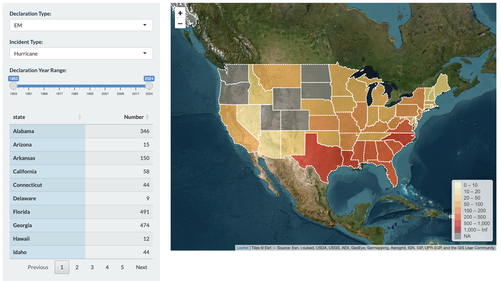

# Project 2: Shiny App Development

### [Project Description](doc/project2_desc.md)

Term: Fall 2023



In this second project of GR5243 Applied Data Science, we develop a *Exploratory Data Analysis and Visualization* shiny app using one of **the OpenFEMA data sets** of your choice.  

The **learning goals** for this project is:

- business intelligence for data science
- data cleaning
- data visualization
- systems development/design life cycle
- shiny app/shiny server

## FEMA Disaster Declarations
Term: Spring 2024

+ Team 6
+ **Projec title**: + Team members
	+ Colin Chan
	+ Qu Fei An
	+ Jia Wei
	+ Wenjun Yang

+ **Project summary**: Our group builds a shiny app to visualize declared disaster events in the U.S. from 1953 to 2024. The [data set](https://www.fema.gov/openfema-data-page/disaster-declarations-summaries-v2) from FEMA records all federally declared disasters from 1953. We cleaned and wrangle the data to make it useful for shiny app. This app aims to featrue the interactive visualization on bar plot, map plot, and time plot. Users can input one or some featrues of the data set to access interactive charts and graphs. Based on the charts and graphs in the app, we look back the past disaster events and find some patterns. These patterns would benefit to disaster prevention. 

+ **Contribution statement**: Colin Chan, Qu Fei An, Jia Wei and Wenjun Yang designed the study. Jia Wei designed introduction and reference in shiny app. Qu Fei An designed bar plot in shiny app. Colin Chan designed map plot in shiny app. Wenjun Yang designed time plot in shiny app. All team members approve our work presented in our GitHub repository including this contribution statement. All team members contributed equally in all stages of this project. All team members approve our work presented in this GitHub repository including this contributions statement.


```
proj/
├── app/
├── lib/
├── data/
├── doc/
└── output/
```

Please see each subfolder for a README file.

